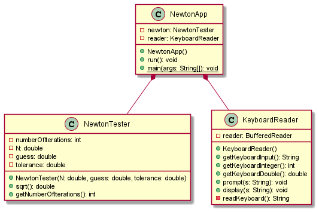
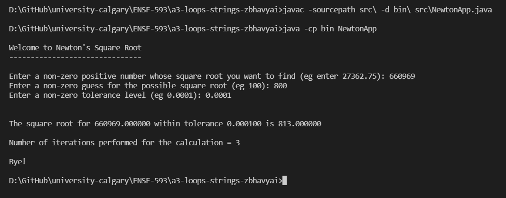
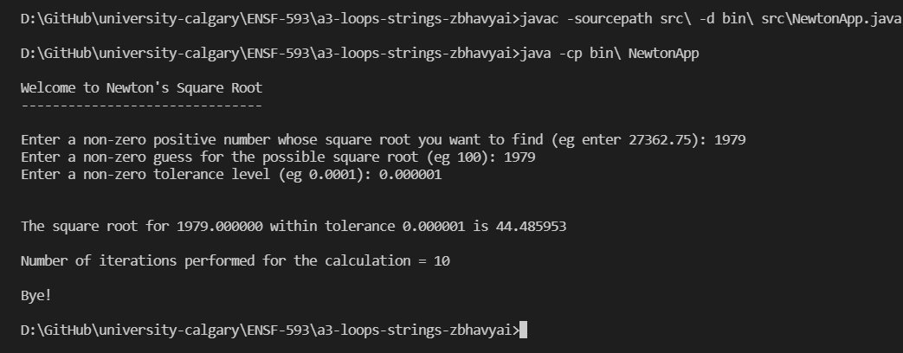
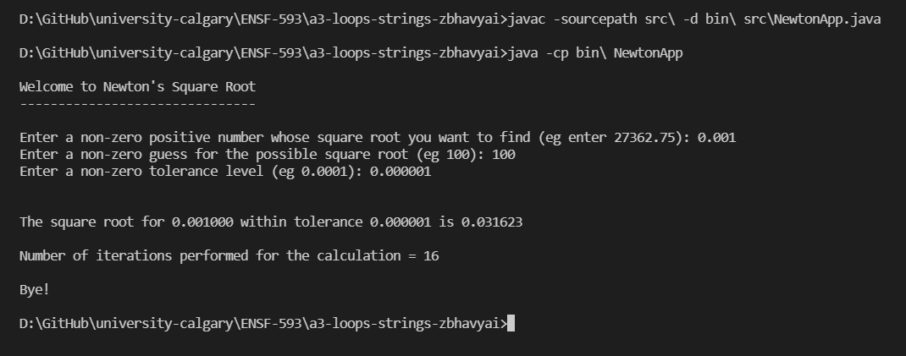

# Newton report

Author: Bhavyai Gupta


## UML class diagram

  


## Execution and Testing

### Testcase 1

The following numbers are chosen for this testcase

```
N = 660969
guess = 800
tolerance = 0.0001
```

For this testcase, numbers are chosen such that
+ `N` is a perfect square
+ `guess` is quite close to the actual square root of `N`



The output of the NewtonApp is `813.000000` and actual square root is `813`


### Testcase 2

The following numbers are chosen for this testcase

```
N = 1979
guess = 1979
tolerance = 0.000001
```

For this testcase, numbers are chosen such that
+ `N` is a prime number and therefore not a perfect square
+ `guess` is made equal to `N`, and is off to the actual square root
+ Error is reduced by decreasing the `tolerance`




The output of the NewtonApp is `44.485953` and actual square root is `44.4859528...`, and the difference between them is within the  `tolerance` supplied


### Testcase 3

The following numbers are chosen for this testcase

```
N = 0.001
guess = 100
tolerance = 0.000001
```

Above numbers are chosen because
+ `N` is less than 1 and not a perfect square
+ `guess` made is very off to the actual square root
+ `tolerance` is level is kept same as [Testcase 2](#testcase-2)




The output of the NewtonApp is `0.031623` and actual square root is `0.031622776...`, and the difference between them is within the  `tolerance` supplied
